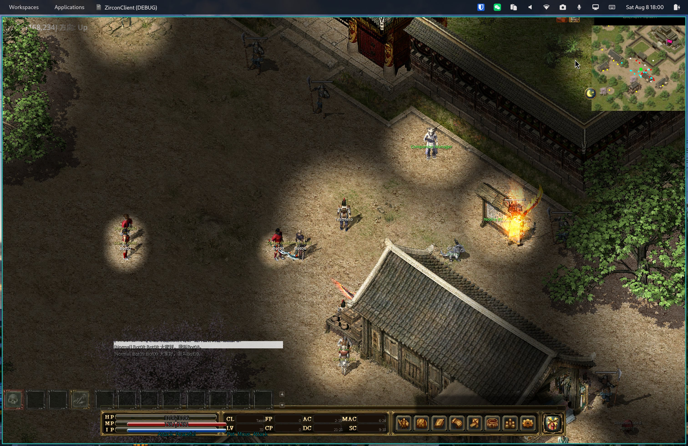
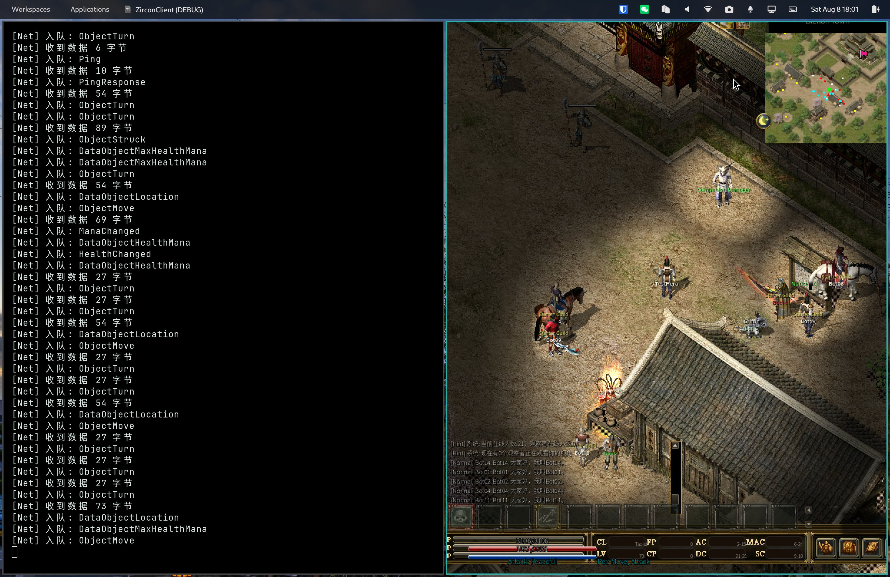
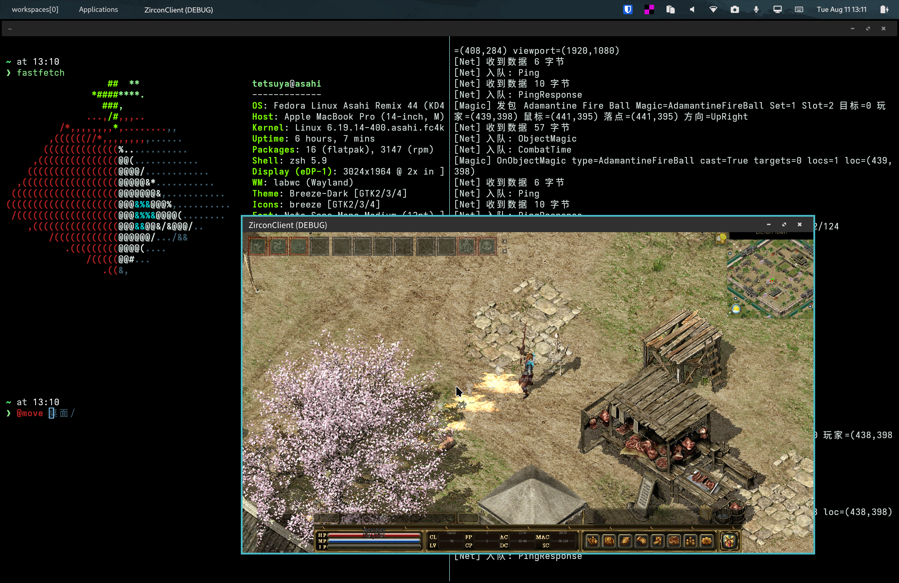

# Zircon — Legend of Mir 3（传奇 3）

原项目：[Suprcode/Zircon](https://github.com/Suprcode/Zircon) · 社区：[LOMCN 论坛](http://www.lomcn.org/forum/forumdisplay.php?735)

传奇 3 的 C# 服务端 + 客户端代码库。本仓库是 Zircon 的 fork，当前主要目标是：**用 Godot 重写跨平台客户端，连接原版服务端**（先本机开发，后续支持远程服务器和 Web）。

> 📚 **学习笔记**：[`docs/notes/`](docs/notes/) 记录架构决策、服务端运行、协议验证和客户端重写过程。数据库自动生成文档位于 [`docs/database/`](docs/database/)。

## 为什么用 Godot 重构

原客户端无法跨平台直接复用：`Client/` 是 `net10.0-windows8.0` + WinForms，渲染依赖 SharpDX/D3D11，客户端界面和游戏逻辑也高度耦合。

服务端逻辑是纯 .NET、跨平台，客户端资产（图库、地图、声音、数据库）已经取得。因此路线是：

> **ServerCore 无头服务端尽量原样运行，Godot(C#) 客户端通过 TCP 连接它；服务端负责游戏规则和状态，Godot 负责渲染、输入和 UI。**

协议层（packet 序列化、TCP 收发和 `BaseConnection`）已经在 `LibraryCore/` 中，可以由 Godot 客户端复用。

## 复用边界

| 层 | 处置 | 说明 |
|---|---|---|
| `ServerLibrary/` | ✅ 原样复用 | 服务端核心逻辑，目标框架为跨平台 .NET |
| `LibraryCore/` | ✅ 原样复用 | MirDB、SystemModels、网络 packet 和 `BaseConnection` |
| `ServerCore/` | ✅ 原样复用 | Linux 可运行的无头服务端 host，默认监听 TCP `7000` |
| `Server/` | ⛔ Windows 专用 | DevExpress/WinForms 可视化编辑器 |
| `Client/` | ♻️ 部分参考 | 网络层可参考；WinForms/SharpDX 渲染层由 Godot 重写 |
| `GodotClient/` | 🚧 持续开发 | 跨平台客户端、游戏场景、UI 和资源渲染 |
| `System.db`、`.Zl`、`.map`、声音 | ✅ 直接使用 | 原版数据和资源 |

## 架构：客户端与服务端分离

```
┌──────────────────┐   TCP 7000   ┌────────────────────────┐
│ ServerCore       │ ◄──────────► │ GodotClient            │
│ 无头游戏服务端    │   packets    │ 跨平台客户端重写        │
│ 规则、账号、地图、 │              │ 渲染、UI、输入、资源加载 │
│ 玩家和战斗状态     │              │                        │
└──────────────────┘              └────────────────────────┘
```

本机开发通常使用 `127.0.0.1:7000`；远程部署时服务端绑定服务器地址，客户端只需把连接地址改为服务器 IP。登录流程为 `Connect → CheckVersion → Login → SelectCharacter → StartGame`。

## 当前路线图

| 步骤 | 内容 | 状态 |
|---|---|---|
| 第 0 步 | Linux 编译 ServerLibrary、读取 System.db 和基础数据 | ✅ 已完成 |
| 第 1 步 | ServerCore 启动、TCP 连通和登录协议验证 | ✅ 已完成并持续维护 |
| 第 2 步 | Godot 客户端连接、登录和选角色流程 | ✅ 骨架已完成 |
| 第 3 步 | `.Zl` 图库、`.map` 地图读取与地图渲染 | 🔨 持续完善 |
| 第 4 步 | 逐 packet 接入移动、攻击、背包、技能和完整 UI | ⏳ 进行中 |
| 第 5 步 | 远程服务器部署、Web 客户端和长期运行 | 💤 后续阶段 |

## 游戏截图

以下截图来自 Godot 客户端实际运行：







## 环境与构建

需要 .NET 10 SDK 和 Godot 4.x .NET 版。Windows 原客户端/编辑器还需要 WinForms、DevExpress 和 DirectX 依赖。

```bash
dotnet restore ServerCore/ServerCore.csproj
dotnet build ServerCore/ServerCore.csproj
godot-mono --path GodotClient/
```

运行 ServerCore 前，运行目录需要准备 `Server.ini`、`Database/` 和 `Map/`。默认网络配置为：

```ini
[Network]
IPAddress=127.0.0.1
Port=7000
UserCountPort=3000
```

远程部署请先前台验证，再使用 tmux 或 systemd 托管。

## 仓库结构

```
Client/          原 WinForms 客户端（网络层参考，渲染层不跨平台）
Server/          Windows/DevExpress 数据与服务端编辑器
ServerLibrary/   服务端核心逻辑
ServerCore/      Linux 可运行的无头服务端 host
LibraryCore/     MirDB、SystemModels、网络协议和共享基础代码
GodotClient/     Godot C# 跨平台客户端
LibraryEditor/   .Zl/WIL 等图库编辑和读取代码
RenderingCore/   原 Windows 渲染组件
docs/notes/      架构、运行和调试笔记
docs/database/   数据库内容文档
```

## 研究资料仓库

原版客户端逆向、WIL/WIX/DAT/MAP 解码工具、地图/UI 调查资料、证据 JSON 和 HTML 模拟器已拆分到独立仓库：

**Mir3-Research**：`/home/tetsuya/development/Mir3-Research`

该仓库负责研究“20 年前原版客户端是什么样、资源如何解码、坐标和 UI 如何还原”；本仓库负责继续开发可运行的 Zircon 服务端和 Godot 客户端。两者协作，但研究工具不重新混入正式源码仓库。

大型运行资源不进入 Git，请按本机情况准备 `Debug/`、`Resource/`、数据库、地图和原版客户端目录。

---

*维护说明：本 README 由中文编写。架构决策更新本文档；原版资源逆向结果同步记录到 Mir3-Research。*
