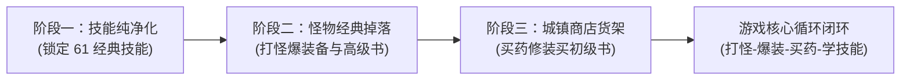

# 经典传奇 3 核心循环三阶段实施流水线规范（技能 · 掉落 · 经济）

> **文档性质**：执行智能体分阶段标准作业指引（SOP） & 提交纪律规范  
> **制定时间**：2026-10-04  
> **核心原则**：**分步实施、每步验证、独立提交推送、严格追溯**

---

## 一、架构总览：核心循环“铁三角”

本任务将**技能（Magic）**、**掉落（Drops）**、**经济货架（Goods）**三大紧密耦合的系统合并为一个连续推进工程。三者共同构成游戏的最小可玩闭环：



### 🔴 核心提交纪律（绝对红线）
1. **严禁一次性大泥球提交**：必须严格分为 3 个阶段推进，每完成一个阶段并完成实机验证后，**立即单独执行一次 Git Commit 并 Push 到 `origin master`**；
2. **写库四处镜像必须严格对齐**：任何阶段修改 `System.db`，都必须在停服状态下执行，并同步覆盖以下 4 处镜像，`md5sum` 必须 100% 完全一致：
   - `Debug/ServerCore/Database/System.db`
   - `/home/tetsuya/mir2ei/Data/System.db`
   - `/home/tetsuya/mir2ei/Database/System.db`
   - `./System.db`
3. **行为验证 ≥ 编译验证**：每个阶段必须启动服务端和 GodotClient，登录 `TestHero` 实机测试并截图取证。

---

## 二、阶段一（Phase 1）：技能与魔法体系纯净清洗

### 1. 目标与范围
- 从现存的 174 个技能中，彻底剔除 113 个非经典技能（刺客技能、弓手技能、私服自制技能）；
- 严格锁定 17173 标准的 **61 个经典三职业技能**（战士 13 个、法师 26 个、道士 22 个）；
- 校对 61 个技能的学习等级、蓝耗、修炼点数及元素属性。

### 2. 权威数据源
- 17173 技能基准清单：`/home/tetsuya/development/mir3-website/data/skills.json`
- Mud3 原版技能定义：`/home/tetsuya/development/Mir3-Research/reference/mir3-source/Mud3-Config/Envir/Magic.txt`
- 数据库表：`System.db` 的 `MagicInfo`

### 3. 执行细节
1. 终止 `ServerCore` 进程；
2. 备份 4 处 `System.db` 与 `Users.db`；
3. 编写/运行工具（如 `Tools/MagicPurityFixer/`），以 61 个经典技能为白名单：
   - 保留的 61 个技能：核验职业所属（Warrior/Wizard/Taoist）、需求等级（如战士 7 级基本剑术、19 级攻杀、28 级刺杀、35 级烈火）、MP 消耗、元素类型（火/冰/雷/风/神圣/暗黑/灵魂）；
   - 超纲技能：从 `MagicInfo` 中解绑/停用，并清除 `Users.db` 的 `UserMagic` 孤立记录；
4. 写库并同步 4 处镜像，验证 MD5 完全一致；
5. 同步更新 `mir3-website/data/skills.json`。

### 4. 阶段一验证与提交要求
- **实机验证**：启动服务与客户端，登录 `TestHero`，使用 `@giveSkills` 给全套技能，按 `F11` 检查技能面板，确认仅有经典技能且图标描述正确；施放烈火、雷电、治愈术确认动作特效正常；
- **截图存证**：截取技能面板存入 `docs/screenshots/phase1_magic/`；
- **独立提交**：
  ```bash
  git commit -m "阶段一：完成 61 个经典三职业技能纯净清洗与数据对齐"
  git push origin master
  ```

---

## 三、阶段二（Phase 2）：怪物经典掉落与爆率体系对齐

### 1. 目标与范围
- 消除掉落表中的悬空外键（彻底清除已删刺客/私服物品的掉落）；
- 以原版 Mud3 的 `MonDrop` 配置为基准，对齐经典怪物（白野猪、尸王、沃玛教主、祖玛教主、基础怪物）的正统产出与概率；
- 确保高级技能书由尸王产出，沃玛武器/首饰由白野猪及对应 Boss 产出。

### 2. 权威数据源
- Mud3 原版掉落配置目录：`/home/tetsuya/development/Mir3-Research/reference/mir3-source/Mud3-Config/Envir/MonDrop/`
- 当前 399 件纯净物品表：`System.db` 的 `ItemInfo`
- 怪物掉落关联表：`System.db` 的 `DropInfo` 与 `MonsterInfo.Drops`

### 3. 执行细节
1. 终止 `ServerCore` 进程；
2. 备份 4 处 `System.db`；
3. 编写/运行工具（如 `Tools/DropTableAligner/`）：
   - 读取 Mud3 `MonDrop` 文本中代表性怪物的掉落规则；
   - 建立怪物 -> 物品 -> 概率（1/N）字典；
   - 清理所有现存怪物掉落中非 399 集合的废弃项；
   - 为尸王注入阶段一清洗出的 35 级高级技能书（烈火、冰咆哮、狗书、半月等）；
   - 为白野猪、沃玛教主、祖玛教主注入对应的沃玛/祖玛级装备与首饰；
   - 校对金币掉落范围（`GoldDrop`）；
4. 写库并同步 4 处镜像，验证 MD5 完全一致。

### 4. 阶段二验证与提交要求
- **实机验证**：启动服务与客户端，登录 `TestHero`，使用 `@monster 尸王 1` 或 `@monster 白野猪 1` 击杀，观察掉落物品名称、地面模型与金币堆叠效果，捡起确认顺利入包；
- **截图存证**：截取怪物掉落现场截图存入 `docs/screenshots/phase2_drops/`；
- **独立提交**：
  ```bash
  git commit -m "阶段二：完成经典怪物掉落表与爆率体系对齐"
  git push origin master
  ```

---

## 四、阶段三（Phase 3）：城镇 NPC 商店货架与经济修理系统对齐

### 1. 目标与范围
- 为各大核心城镇（银杏村、比奇城、道馆、潘夜村、沙巴克等）的商铺配置经典货架；
- 严禁货架出售高级沃玛/祖玛装备（高级装备必须靠阶段二打怪产出）；
- 商店仅出售初级过渡装、基础药水、传送卷轴、初级技能书；
- 校准买入、出售回收与普通修理/特殊修理费率。

### 2. 权威数据源
- Mud3 原版商品配置：`/home/tetsuya/development/Mir3-Research/reference/mir3-source/Mud3-Config/Envir/Market_Prices/`
- 17173 物品价格表：`/home/tetsuya/development/mir3-website/data/items.json`
- 数据库表：`System.db` 的 `NPCGood` 表与 `ItemInfo.Price`

### 3. 执行细节
1. 终止 `ServerCore` 进程；
2. 备份 4 处 `System.db`；
3. 编写/运行工具（如 `Tools/NpcGoodsAligner/`）：
   - 梳理商品分类（药水类、杂货类、武器类、服装类、首饰类、书店类）；
   - 配置货架清单：
     - **药店**：金创药(小/中)、魔法药(小/中)、太阳水、强效药水、解毒剂；
     - **武器店**：木剑、乌木剑、短剑、铁剑、青铜剑、青铜斧、八荒、海魂；
     - **服装店**：布衣(男/女)、轻盔甲(男/女)；
     - **首饰店**：古铜戒指、铁手镯、小手镯、金项链、传统项链；
     - **杂货店**：蜡烛、火把、随机传送卷、地牢逃脱卷、回城卷、修复油；
     - **书店**：7~15 级初级三职业技能书（火球术、基本剑术、治愈术、精神力战法等）；
   - 确保 `NPCGood.Item` 100% 落在 399 纯净物品表内；
   - 校准物品基础价格 `Price`，设定买卖折价与修理系数；
4. 写库并同步 4 处镜像，验证 MD5 完全一致。

### 4. 阶段三验证与提交要求
- **实机验证**：启动服务与客户端，登录 `TestHero`，前往银杏村或比奇城药店、武器店、书店：
  - 点击店主打开货架，检查货架整齐合规；
  - 购买金创药与初级技能书，确认金币扣除、物品进背包；
  - 测试特修与普修功能；
- **截图存证**：截取商店购买面板与成功交易截图存入 `docs/screenshots/phase3_store/`；
- **独立提交**：
  ```bash
  git commit -m "阶段三：完成全城镇 NPC 商店货架与经济修理体系对齐"
  git push origin master
  ```

---

## 五、全流程最终验收 Checklist（总检验收）

三个阶段全部完成后，验收智能体将进行全链路综合验收：

- [ ] **1. 阶段提交完整性**：Git 历史上必须清晰存在 3 次分阶段提交，无大泥球合并；
- [ ] **2. 数据库一致性**：4 处 `System.db` 最终 MD5 绝对一致，服务端启动 0 报错；
- [ ] **3. 技能纯净度**：`F11` 面板仅有 61 个经典三职业技能，无刺客/弓手/私服冗余；
- [ ] **4. 打怪掉落正常**：尸王爆高级书、白野猪爆三神兵、小怪爆药水金币，地表模型正常；
- [ ] **5. 商店经济闭环**：城镇店铺卖基础必需品，价格合理，买卖修理全链路打通；
- [ ] **6. 截图取证齐全**：3 个阶段的截图目录均有完整实机验证截图存留。
