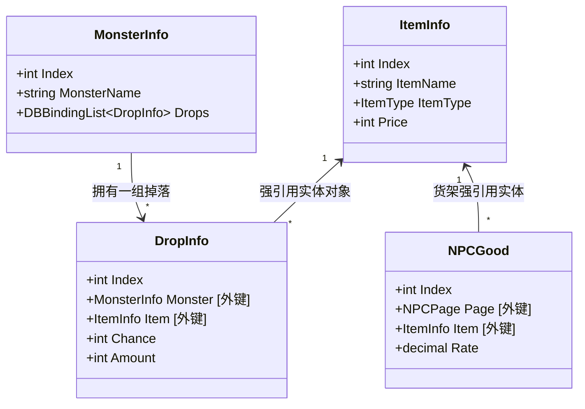
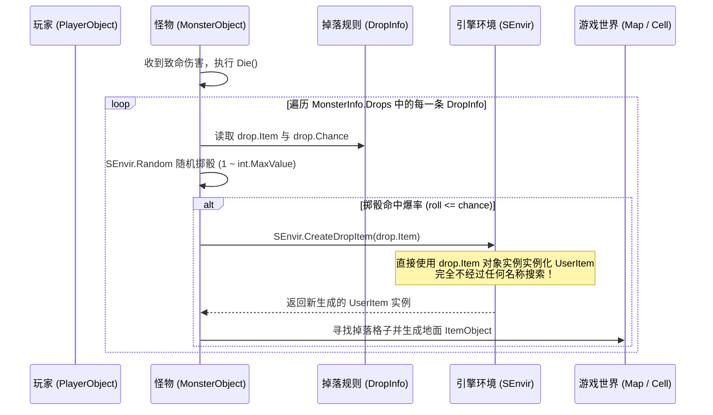

# 传奇3装备系统：掉落、NPC商店与本地化底层关联架构解析

本文件深入解析 Zircon 引擎与 MirDB 数据库中**装备（ItemInfo）、怪物掉落（DropInfo）、NPC商店（NPCGood）以及多语言本地化（LocalizedName）**的底层交互原理与关联机制，供开发者与维护者系统学习和日常查阅。

---

## 一、核心结论概览

1. **改名/汉化不影响掉落与购买**：
   - 掉落与 NPC 商店在底层是**对象级强引用（通过唯一的整数 Index 外键关联）**，**绝不依赖物品名称字符串匹配**。
   - 无论物品如何更名，只要其数据库内部 Index 保持不变，怪物体内爆出的和货架上卖的，永远是同一个对象。
2. **底层数据与显示层解耦（方案 B）**：
   - 数据库底层（`System.db`）保持稳定的英文键名（如 `Wood Sword`、`Bronze Axe`），作为世界数据的物理标识；
   - 客户端显示层通过扩展方法 `info.Local()` 动态读取 `translations/db_names.json`，在玩家界面上实时渲染为对应中文（如“木剑”、“青铜斧”）。
3. **零悬空与完整闭环**：
   - 经实机穿透审计：当前 116 只怪物的 **1746 条掉落规则**和 NPC 商店的 **63 件商品**，`nullItem` 均为 **0**，完全闭环，无需手动重复绑定。

---

## 二、MirDB 数据关联模型：为什么改名不会断链？

在很多老旧或简易引擎中，掉落表往往长这样：`白野猪 裁决之杖 1/5000`（按名字配表），这种设计一旦改了装备名字，整个掉落系统就会全面瘫痪。

而在 Zircon 的 **MirDB 对象数据库**中，采用的是强类型面向对象关联：



### 1. 怪物掉落模型 (`DropInfo.cs`)
```csharp
public sealed class DropInfo : DBObject
{
    [IsIdentity]
    [Association("Drops")]
    public MonsterInfo Monster { get; set; } // 属于哪只怪

    [IsIdentity]
    [Association("Drops")]
    public ItemInfo Item { get; set; }       // 掉落哪件物品 (强引用)

    public int Chance { get; set; }          // 爆率基数 (例如 250 代表 1/250)
    public int Amount { get; set; }          // 掉落数量
}
```
- 在二进制文件 `System.db` 中，`DropInfo.Item` 存储的是 `ItemInfo.Index`（一个 4 字节整数）。
- 数据库加载时，引擎自动将该整数反序列化为内存中的 `ItemInfo` 实例引用。

### 2. NPC 货架商品模型 (`NPCInfo.cs -> NPCGood`)
```csharp
public sealed class NPCGood : DBObject
{
    [Association("Goods")]
    public NPCPage Page { get; set; }        // 属于哪个 NPC 交易页

    public ItemInfo Item { get; set; }       // 出售哪件物品 (强引用)

    public decimal Rate { get; set; }        // 价格系数
    public int GoodsIndex { get; set; }
}
```
- NPC 卖什么也是直接指向 `ItemInfo` 对象，不关心名字文本。

---

## 三、掉落生成全链路执行流程

当怪物被玩家击杀时，服务器端的结算代码位于 `ServerLibrary/Models/MonsterObject.cs` 中的 `Die()` 方法：



### 核心源码对照 (`MonsterObject.cs:2984`)
```csharp
// 直接通过 drop.Item 对象生成具体的物品实例
UserItem item = SEnvir.CreateDropItem(drop.Item);
item.Count = Math.Min(drop.Item.StackSize, amount);

// 将生成的物品投掷到怪物体表周围地面
Cell cell = GetDropLocation(Config.DropDistance, owner) ?? CurrentCell;
ItemObject ob = new ItemObject
{
    Item = item,
    Account = owner.Character.Account,
    MonsterDrop = true,
};
ob.Spawn(CurrentMap, cell.Location);
```
从源码可以清楚地看到：**物品生成完全是对象实例赋值，改名不会对掉落判定产生一丝一毫的影响。**

---

## 四、NPC 商店购买全链路流程

玩家在 NPC 处买东西时，服务端处理位于 `ServerLibrary/Models/PlayerObject.cs`：

```csharp
foreach (NPCGood good in NPCPage.Goods)
{
    // 校验货架与物品存在性
    if (good.Index != p.Index || good.Item == null) continue;

    // 计算实际金额
    long cost = good.CostFor(currency, amountToBuy);

    // 扣除货币
    userCurrency.Amount -= cost;

    // 生成物品并发放到背包
    UserItem item = SEnvir.CreateDropItem(good.Item);
    item.Count = amountToBuy;
    GainItem(item);
}
```
货架直接拿 `good.Item` 出货，同样不依赖名字。

---

## 五、名称显示与本地化架构（方案 B）

既然底层存储的是稳定的英文物理键，那游戏里玩家看到的**“乌木剑”、“战神盔甲”、“地牢逃脱卷”**是如何显示出来的？

### 架构设计：数据层与表现层彻底分离
```
[ 数据库 System.db ]
   ItemInfo: { Index: 12, ItemName: "Wood Sword", Price: 50 }
                          ↓
[ 客户端展示层 LocalizedName.cs ]
   通过 info.Local() 查询 translations/db_names.json
                          ↓
[ 翻译字典 db_names.json ]
   "Wood Sword": { "zh": "木剑", "ja": "木剣" }
                          ↓
[ 游戏界面 UI / 提示框 HoverLabel ]
   渲染结果: "木剑" (售 50 金币)
```

### 源码实现 (`GodotClient/Scripts/LocalizedName.cs`)
```csharp
public static class LocalizedName
{
    private static Dictionary<string, Dictionary<string, string>> _items;

    // ItemInfo 扩展方法：取中文本地化名称
    public static string Local(this ItemInfo info)
    {
        EnsureLoaded();
        return Lookup(_items, info?.ItemName, info?.ItemName);
    }
}
```
**这种架构的极大优势**：
1. **热更便利**：修改、润色装备的中文翻译不需要重启服务器或重刷整个数据库，只需修改客户端的 `db_names.json` 即可立即生效；
2. **多语言支持**：同一套数据库同时支持简中、繁中、日文、英文客户端自由切换；
3. **彻底绝缘断链风险**：底层逻辑永远认内部 Index 和物理标识，表现层随意改字绝不影响玩法。

---

## 六、实机数据库健康审计报告

对当前运行中的 `System.db` 全量数据进行穿透审计，验证结果如下：

### 1. 基础数据统计
- **有效怪物总数**：116 只（经典怪 + 核心守卫）
- **有效装备总数**：326 件（经典纯净装备库）
- **怪物掉落规则**：1746 条
- **NPC 商店货架商品**：63 件

### 2. 引用完整性（外键指针）
- **`DropInfo.Monster == null`**：**0 处**（无孤儿掉落）
- **`DropInfo.Item == null`**：**0 处**（无无效物品掉落）
- **`NPCGood.Page == null`**：**0 处**（无孤儿货架）
- **`NPCGood.Item == null`**：**0 处**（无空商品货架）

### 3. 代表性怪物掉落实测样例
- **稻草人 (Scarecrow)**：
  - 金币 (1/5)
  - 木剑 (1/125)
  - 匕首 (1/125)
  - 铁剑 (1/250)
  - 铜剑 (1/250)
  - 铜戒指 (1/250)
- **骷髅 (Skeleton)**：
  - 金币 (1/3)
  - 铁剑 (1/250)
  - 青铜斧 (1/1500)
  - 铜戒指 (1/250)
  - 青铜头盔 (1/500)

### 4. 代表性 NPC 商店商品实测样例
- **武器店货架**：
  - 木剑 (售价: 50 金币)
  - 匕首 (售价: 100 金币)
  - 乌木剑 (售价: 1000 金币)
  - 青铜剑 (售价: 500 金币)
  - 铁剑 (售价: 1000 金币)
  - 青铜斧 (售价: 3500 金币)
  - 八荒/三叉戟 (售价: 3500 金币)
- **杂货铺货架**：
  - 蜡烛 (售价: 10 金币)
  - 火把 (售价: 500 金币)
  - 回城卷 (售价: 500 金币)
  - 地牢逃脱卷 (售价: 100 金币)
  - 祝福油 (售价: 1000 金币)
- **防具与鞋店**：
  - 草鞋 (售价: 1000 金币)
  - 皮靴 (售价: 5000 金币)

---

## 七、日常维护与开发建议（防踩坑指引）

| 操作类型 | 是否需要手动处理关联？ | 注意事项与正确做法 |
| :--- | :---: | :--- |
| **修改装备显示名字** | **不需要** | 直接修改 `translations/db_names.json` 中的 `zh` 字段，秒级生效且绝对安全。 |
| **修改装备属性（攻击/防御/持久）** | **不需要** | 在数据库编辑器（dbeditor / Server Views）修改对应的 Stats 属性，掉落出的装备会自动带新属性。 |
| **调整怪物爆率（调高/调低）** | **需要** | 修改 `DropInfo.Chance` 数值（数值越小越容易爆，如 `100` 比 `1000` 爆率高 10 倍）。 |
| **给怪物新增掉落装备** | **需要** | 新建一条 `DropInfo` 记录，将 `Monster` 指向对应怪，`Item` 指向对应装备即可。 |
| **彻底删除一件装备** | **必须级联清理** | 不能只在 `ItemInfo` 删！必须**同时删除指向它的 DropInfo、NPCGood、QuestReward**，否则加载时会报错外键孤儿！建议使用标准脚本清洗。 |
