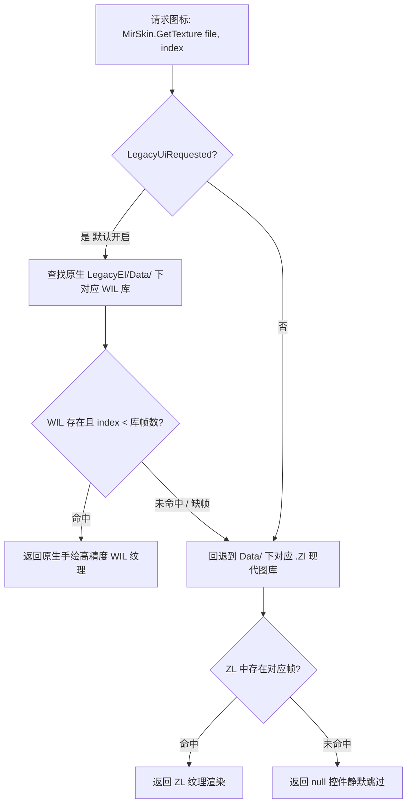

# 传奇3经典背包多格占位与双层图库回退架构 (Legacy Item Grid & Texture Fallback Architecture)

## 一、概述与核心设计目标

在传奇3经典版（EI 3.0）与现代 Zircon 版本的演进过程中，物品系统存在两项重大的视觉与交互差异：
1. **背包占格差异**：
   - **旧版（EI 经典版）**：采用暗黑式多格占位（Footprint），大件装备占用多格（衣服通常为 $2 \times 3$ 或 $2 \times 2$，长柄武器 $1 \times 4$ 或 $1 \times 3$，首饰/药品为 $1 \times 1$）。
   - **现代版（Zircon 上游）**：网络传输只传递单一槽位号（Slot 0..45），UI 默认扁平单格显示。
2. **图库素材差异**：
   - **旧版**：使用原生手绘多帧大图标，存放于 `Inventory.wil`。
   - **现代版**：使用压缩重排后的 `.Zl` 格式（如 `StoreItem.Zl` / `Inventory.Zl`）。

本项目在客户端成功实现了**“协议零改动下的客户端首空多格重建”**与**“原生 WIL 优先、现代 ZL 平滑回退的双层图库加载管线”**，既原汁原味还原了经典传奇3大背包的质感，又兼顾了现代拓展装备的平滑兼容。

---

## 二、多格占位机制（Legacy Footprint 算法）

### 1. 核心触发与开关
在背包初始化时（[`GodotClient/Controls/InventoryDialog.cs`](file:///home/tetsuya/development/zircon/GodotClient/Controls/InventoryDialog.cs)）：
```csharp
Grid.UseLegacyFootprints = true;
Grid.ItemLibraryFile = LibraryFile.Inventory;
```

### 2. 动态像素换算公式（Pixel to Grid Cells）
旧版服务端并未在协议中硬编码物品的宽和高，而是由客户端读取图库中物品贴图的实际像素尺寸动态换算（[`GodotClient/Controls/DXItemGrid.cs`](file:///home/tetsuya/development/zircon/GodotClient/Controls/DXItemGrid.cs)）：
```csharp
private static void GetLegacyFootprint(ClientUserItem item, out int width, out int height)
{
    width = height = 1;
    if (item?.Info == null) return;
    
    // 读取 Inventory.wil 实际贴图
    var texture = MirSkin.GetTexture(LibraryFile.Inventory, item.Info.Image);
    if (texture == null) return;
    
    Vector2 size = texture.GetSize();
    // 单格基准尺寸 CellWidth = 36px, CellHeight = 36px
    width = Math.Max(1, ((int)size.X + DXItemCell.CellWidth - 1) / DXItemCell.CellWidth);
    height = Math.Max(1, ((int)size.Y + DXItemCell.CellHeight - 1) / DXItemCell.CellHeight);
}
```
- **衣服（Cloth/Armor）**：贴图约为 $68 \times 102$ 像素 $\longrightarrow$ 换算为 **$2 \times 3 = 6$ 格**。
- **武器（Weapon）**：贴图约为 $34 \times 130$ 像素 $\longrightarrow$ 换算为 **$1 \times 4$ 格**。
- **药品/护身符（Potion/Amulet）**：贴图约为 $30 \times 30$ 像素 $\longrightarrow$ 换算为 **$1 \times 1$ 格**。

### 3. 首空适应排列（First-fit Placement）
由于现代协议只发送玩家背包中线性的 Slot 记录，`DXItemGrid` 在收到网络数据后，会在本地二维网格中自左向右、自上而下寻找能够完整容纳该 footprint 面积的空位（`TryPlace`）：
- `_legacyCellAnchors[cell]`：记录该单元格归属于哪个物品 Slot（被占用的全部格子均指向该 Slot）；
- `_legacyCellOrigins[cell]`：标记该格子是否为该物品的**左上角原点格（Origin Cell）**。
- **渲染规则**：仅原点格负责绘制贴图，其余被覆盖格子作为透明占位，避免贴图重复绘制。

### 4. 复合区域选中与悬停高亮
在鼠标悬停或选中物品时（`RefreshLegacyHighlight`）：
- 覆盖层 `_legacyHighlight` 不再只框选单个 36px 格子，而是根据该物品的占位宽高等比拉伸，以绿色边框（`Colors.Lime`）与半透明橘黄色底色将整片 $2 \times 3$ 区域完整框选。

---

## 三、双层图库回退管线（WIL $\to$ ZL Fallback）

图库加载统一由 [`GodotClient/Controls/MirSkin.cs`](file:///home/tetsuya/development/zircon/GodotClient/Controls/MirSkin.cs) 驱动：



### 关键代码路径
```csharp
// GodotClient/Controls/MirSkin.cs
public static Texture2D GetTexture(LibraryFile file, int index)
{
    if (index < 0) return null;
    var key = (file, index);
    if (_textures.TryGetValue(key, out var tex) && tex != null) return tex;

    // 1. 优先从 LegacyEI 原版 WIL 读取（如 Inventory.wil）
    if (LegacyUiRequested)
    {
        LegacyWilLibrary legacy = GetLegacyWilLibrary(file);
        if (legacy != null && index < legacy.Count)
        {
            tex = legacy.GetImageTexture(index);
            if (tex != null)
            {
                _textures[key] = tex;
                return tex;
            }
        }
    }

    // 2. 自动回退到现代 .Zl 格式（如 StoreItem.Zl）
    var library = GetLibrary(file);
    if (library == null || index >= library.Count) return null;
    tex = library.CreateTexture(index);
    if (tex != null) _textures[key] = tex;
    return tex;
}
```

---

## 四、主要优势与维护注意事项

1. **新旧资源无冲突共存**：
   - 经典旧版物品：读取 `LegacyEI/Data/Inventory.wil`，呈现原版细腻大图并准确占多格；
   - 现代新增物品：即使旧版 WIL 中没有收录，也能无缝从现代 `.Zl` 库读出并兜底显示，不会产生红叉或黑块异常。
2. **拖拽与操作一致性**：
   - 单元格点击时，通过 `ResolveOperationSlot(cellIndex)` 自动将子占位格解析为其所属的主物品 Slot，保证拖拽、右键使用、修理、存仓与服务端通讯完全无歧义。
3. **坐标与步距（Step & Padding）**：
   - `Inventory.wil` 素材基准步距为 `DXItemCell.CellWidth`（36px），不要随意混用带外边框 padding 的公式，以免高亮框与网格错位。
