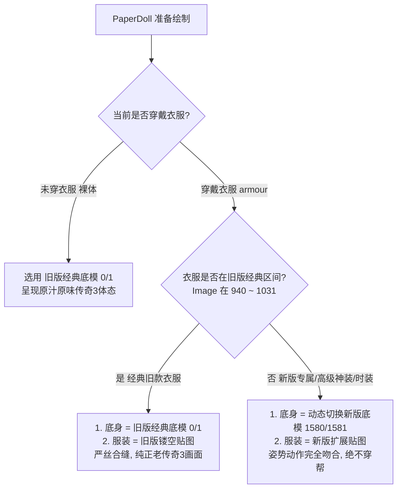

# 角色纸娃娃（PaperDoll）旧版底模与新版扩展衣服自适应混合方案

**文档状态**：已立项 / 方案确定  
**创建时间**：2026-10-04  
**涉及模块**：
- 客户端渲染：`GodotClient/Controls/PaperDoll.cs`、`DXCreatePreviewControl.cs`
- 客户端资源：`mir2ei/Data/ProgUse.Zl`、`mir2ei/Data/Equip.Zl`
- 权威源资产：`/data/NAS/TMP/EI传奇3.0客户端/Data/ProgUse.wil`、`Equip.wil`

---

## 1. 需求背景与核心痛点

### 1.1 复刻目标
打造纯正的原版传奇3（EI）视觉体验。在角色装备属性面板（F10 / CharacterDialog）中，玩家裸身状态与经典职业服装应当完美还原老传奇3的体态、脸型与服装剪裁。

### 1.2 资源演进带来的冲突与痛点
经使用 `wilsdk` 与 `zlsdk` 在像素级别对比权威源与当前客户端资源，发现人物姿态发生了重大重构：

| 对比维度 | 原版传奇3（旧版 / EI） | 当前客户端（新版 / Zircon 现有） |
| :--- | :--- | :--- |
| **男角色体型（ProgUse 0）** | 96×172，经典半蹲开立步，双臂平抬微屈握拳，强壮有力 | 84×178，身材偏修长，右腿直立，双臂下垂，肩膀倾斜 |
| **女角色体型（ProgUse 1）** | 96×172，经典半蹲开立步，大腿外展，双臂平抬握拳 | 80×182，体态收拢，两臂贴身自然下垂 |
| **服装内观剪裁（Equip 940~1031）** | **镂空图层**：躯干与四肢镂空，头、颈、手腕、双脚依赖底层裸身透出 | **复合图层**：按新版站姿绘制，自带头脸四肢，手脚姿势完全不同 |
| **服装品类数量** | 仅收录 16 套基础与进阶经典衣服（布衣/轻盔/中型/重盔/灵魂/幽灵/魔法/恶魔） | 包含战神盔甲、玄天、幽灵魔甲、高级神装、时装等海量扩展服装 |

#### 穿帮机制：
若直接将 `ProgUse 0/1` 全局替换为旧版底模，当玩家穿上新版扩展衣服（如 3320+ 的神装或时装）时，新版服装的手脚位置与旧版开立步底模完全错位，裸模的手脚会露在衣服外侧，产生严重的穿模与重影。

---

## 2. 解决方案：自适应混合底模机制（Adaptive Hybrid Body）

采用**“以经典旧版为默认基准，按衣服特征动态切换底模”**的优雅自适应设计：



### 2.1 四大工作状态规范
1. **默认裸身状态（未穿衣服）**：
   - 身体底模采用**旧版底模**（男: `ProgUse[0]`，女: `ProgUse[1]`）；
   - 一进游戏、打开角色面板或脱下装备，立刻呈现老传奇3经典人物造型。
2. **穿戴经典旧版衣服（940~1031 范围内）**：
   - 身体底模：保持使用**旧版底模**；
   - 衣服贴图：采用**旧版镂空贴图**（`Equip[940~1031]`）；
   - 效果：旧版衣服的镂空部分精准对应旧版底模的手腕、脚踝与颈部，100% 像素级对齐。
3. **穿戴新版特有衣服（940~1031 范围外的高级铠甲/时装）**：
   - 身体底模：动态自动切换为**新版底模**（男: `ProgUse[1580]`，女: `ProgUse[1581]`）；
   - 衣服贴图：采用新版扩展贴图；
   - 效果：新版服装与新版体态完全吻合，兼顾新内容的可扩展性。
4. **脱下衣服后**：
   - 自动恢复为旧版经典底模。

---

## 3. 经典旧版 16 套服装范围一览

旧版 `Equip.wil` 中 940~1031 区间内真实存在的有效服装帧清单：

| 帧号 | 服装名称 | 性别 | 对应职业 | 尺寸与偏移量 |
| :--- | :--- | :--- | :--- | :--- |
| **940** | Commoner Outfit (M) 布衣(男) | 男 | 全职业 | 80×154, (-15, -102) |
| **941** | Light Armour (M) 轻型盔甲(男) | 男 | 全职业 | 88×152, (-16, -101) |
| **950** | Commoner Outfit (F) 布衣(女) | 女 | 全职业 | 96×172, (-23, -121) |
| **951** | Light Armour (F) 轻型盔甲(女) | 女 | 全职业 | 96×172, (-23, -121) |
| **980** | Medium Armour (M) 中型盔甲(男) | 男 | 战/法/道 | 80×156, (-14, -103) |
| **981** | Iron Plate Armour (M) 重盔甲(男) | 男 | 战士 | 96×156, (-15, -104) |
| **990** | Medium Armour (F) 中型盔甲(女) | 女 | 战/法/道 | 96×172, (-23, -121) |
| **991** | Iron Plate Armour (F) 重盔甲(女) | 女 | 战士 | 96×172, (-23, -121) |
| **1000** | Faith Robe (M) 灵魂战衣(男) | 男 | 道士 | 80×154, (-14, -102) |
| **1001** | Robe Of Balance (M) 幽灵战衣(男) | 男 | 道士 | 80×154, (-15, -100) |
| **1010** | Faith Robe (F) 灵魂战衣(女) | 女 | 道士 | 96×172, (-23, -121) |
| **1011** | Robe Of Balance (F) 幽灵战衣(女) | 女 | 道士 | 96×172, (-23, -121) |
| **1020** | Flame Robe (M) 魔法长袍(男) | 男 | 法师 | 84×156, (-15, -104) |
| **1021** | Robe Of Dark Flame (M) 恶魔长袍(男) | 男 | 法师 | 88×158, (-17, -104) |
| **1030** | Flame Robe (F) 魔法长袍(女) | 女 | 法师 | 96×172, (-23, -121) |
| **1031** | Robe Of Dark Flame (F) 恶魔长袍(女) | 女 | 法师 | 96×172, (-23, -121) |

---

## 4. 落地实施路线

### 步骤 1：资源提取与合成
- 编写脚本从 `/data/NAS/TMP/EI传奇3.0客户端/Data/` 中提取：
  - `ProgUse.wil` 帧 0、1；
  - `Equip.wil` 帧 940~1031（共 16 帧）。
- 注入至客户端 NVMe 资源库：
  - `mir2ei/Data/ProgUse.Zl`：
    - 将原有的新版裸模移至空闲保留区 `1580`（男）、`1581`（女）；
    - 将原版经典裸模写入 `0`（男）、`1`（女）。
  - `mir2ei/Data/Equip.Zl`：
    - 将旧版 16 套服装贴图覆盖写入 `940~1031` 对应槽位。

### 步骤 2：代码逻辑升级（`PaperDoll.cs`）
在 [`PaperDoll.cs`](file:///home/tetsuya/development/zircon/GodotClient/Controls/PaperDoll.cs#L140-L158) 中改造身体层绘制分支：
```csharp
// 判定是否穿戴了经典旧版护甲
bool isLegacyArmour = costume == null && (armour == null || IsLegacyArmour(armour.Info.Image));

// 身体底模：旧版衣服或未穿衣服时用 0/1（旧版底模）；穿新版衣服时动态切 1580/1581（新版底模）
int bodyIndex = isLegacyArmour
    ? (gender == MirGender.Male ? 0 : 1)
    : (gender == MirGender.Male ? 1580 : 1581);

DrawImage(_progUse, bodyIndex, Colors.White);
```

### 步骤 3：多端校验与无缝回归
- 验证裸体时角色面板呈现纯正旧版经典体态；
- 验证穿戴布衣、重盔、幽灵战衣等经典服装时，贴图与肢体严密贴合；
- 验证穿戴新版重装与神装时，底模自动切至新版体态，无外露错位。
